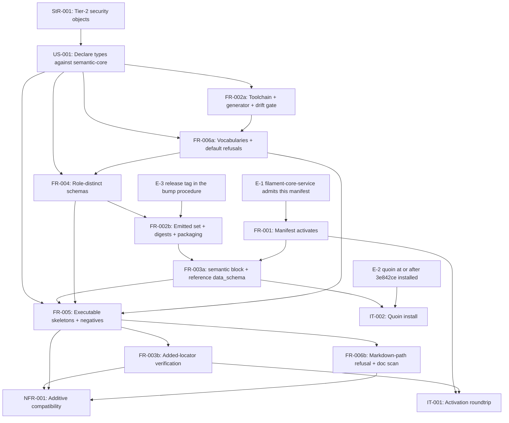

# SR-002: Dependency and ordering review of the #13 semantic module contract spec

## Summary

Dependency and ordering analysis of the `agent-ix/spec-objects-security#13`
spec set (StR-001, US-001, FR-001..FR-006, NFR-001, IT-001, IT-002, TM-001),
with every named external dependency verified read-only on 2026-09-04 against
the reference migration `agent-ix/spec-objects-business#4` and its SR-004
dependency review.

The external dependency **set** is complete and every issue it names exists and
is in the state the spec claims: `spec-artifacts-iso#36`, `quire-rs#392`,
`#221`, `#394`, `#391`, `quoin#290`, `#291`, `#335`, `filament-core-service#23`,
`filament-core-data#11`, `#19`, `#21`, `#22`, `#23`, plus `quire-contract-ir#52`,
`filament-core-data#36` and this repo's `#10` are all OPEN; the prerequisites the
spec calls merged — `quoin#293`, `quire-rs#388`, `filament-core-data#34`, `#35` —
are all CLOSED. Two provisioning gaps that were highs in the reference migration
are genuinely closed here rather than restated: quire 0.46.0 with
`extract_semantic` resolves inside this repo's Python 3.13 poetry env
(`make dev-quire`, `agent-ix/quire-rs#392` named as the blocker), and the npm
publish path needs no `npm ci` (`nodejs-actions/release-npm-module.yml` is
publish-only, so FR-002-CON-4's local-only drift gate has no CI consequence).
Every diagnostic code the spec depends on exists in quire-rs source, including
`semantic.unknown-constraint-keyword` (`src/semantic/properties.rs:735`).

What is wrong is **direction and ordering**, in two places that are load-bearing.
First, one external edge is misdirected in substance: the FR-035 activation
boundary FR-001 and IT-001 claim is verified locally against a
`spec-artifacts-iso` schema that is a strict superset of the real one, so the
green gate is weaker than the boundary. Second, four FR-to-FR cycles remain in
the stated edges — three of them named in the review brief, one inherited from
the reference migration's own disposition — and `spec-to-plan` cannot topologically
order the FR set until each is broken.

## Verdict

**Not ready for `spec-to-plan` as written.** Two highs (FND-220, FND-221): one
is an external boundary that no filament-core-service revision can satisfy while
the local gate reports green, the other is a direct FR-004/FR-006 contradiction
in the schema encoding that makes the two orderings produce different artifacts.
Four mediums (FND-222..FND-225) are dependency cycles that make the stated
`depends_on` edges unsatisfiable as a DAG; four more (FND-226..FND-229) are
misdirected or unpinned external edges a plan must carry as explicit tasks.
Once FND-221..FND-225 are resolved by the splits proposed below, the topological
order in this document is the sequence to plan against.

## Findings

| ID | Severity | Summary | Refs |
|----|----------|---------|------|
| FND-220 | high | The FR-001/IT-001 activation edge is unsatisfiable at every filament-core-service revision, and the local gate hides it. `spec_objects_security/manifest.yaml` carries top-level `traceability` (line 656) and `lexicon` (line 693) besides `semantic`; the FR-035 schema at `origin/main` `a77f31e` is `additionalProperties: false` over fifteen top-level keys — `semantic` and `nav` among them, `traceability`, `lexicon` and `grammar_severity` not — so the service refuses this manifest even on main, and the latest release (v0.8.34) admits neither `semantic` nor the other two. FR-001-AC-1 nevertheless passes because `tests/test_manifest.py` judges the manifest against `spec-artifacts-iso`'s own schema (`sha256:52bddd1c…`), which adds `traceability`, `lexicon`, `grammar_severity`, `verification_catalog` and twelve more `$defs`. FR-001 states no revision, IT-001 states no schema precondition, and neither names the divergence. | FR-001, FR-001-AC-1, IT-001, FR-003, spec.md |
| FND-221 | high | FR-004 and FR-006 mandate contradictory encodings of the same item rule, so their order decides the artifact. FR-004 Behavior requires "`@contains(IdentityField) @minContains(0) @maxContains(0)` for '0 identity fields'"; FR-006 Behavior states "No schema of this module SHALL carry `minContains` or `maxContains`", requires `items: { not: … }`, and FR-006-AC-7 tests the prohibition. The implementation follows FR-006 (`typespec/main.tsp` `AuditEvent`, `items: {not: {$ref: IdentityField.json}}`; no `minContains` in any shipped schema), so FR-004's stated encoding is already refuted by the tree it describes. A plan that tasks FR-004 before FR-006 writes the forbidden form, passes FR-004-AC-9, and fails FR-006-AC-7 afterwards. | FR-004 Behavior, FR-006 Behavior, FR-006-AC-7, FR-004-AC-9 |
| FND-222 | medium | Cycle FR-002 → FR-004 → FR-002. FR-002 frontmatter `depends_on` FR-004 and its Upstream (models) names FR-004, while FR-004's Dependencies name FR-002 as its **Build** and every FR-004 criterion validates a shipped `schemas/<Model>.json` that only FR-002's generator emits. Ordering breaks both ways: FR-004 first has no emitter and no schema files to validate (AC-1..AC-14 all read shipped bytes); FR-002 first compiles an empty module namespace, so FR-002-AC-1's "exactly the twenty-three object-type models plus every declared support model" is an empty list and AC-9's stale-file check is vacuous. Split FR-002 into FR-002a (Inputs, CON-1..CON-5, AC-4, AC-5, AC-8..AC-11 — toolchain, generator, `$id` rule, drift gate, packaging) and FR-002b (AC-1..AC-3, AC-6, AC-7 — emitted set, `$ref` closure, digests, wheel and tarball), then order FR-002a → FR-004 → FR-002b. The reference migration's FND-144 disposition reversed the frontmatter edge only and left FR-004's Build edge standing; this repo inherited both halves. | FR-002, FR-004, FR-002-AC-1, FR-004 Dependencies |
| FND-223 | medium | Cycle FR-004 → FR-006 → FR-004. FR-006 frontmatter `depends_on` FR-004 and FR-004's Downstream names FR-006, but FR-004 Behavior says "Each graded vocabulary SHALL be a closed enum whose members are exactly those listed in FR-006", and FR-004's Outputs claim the ten vocabularies and `DefaultedField` — the same artifacts FR-006's Outputs claim. Seven rows of FR-004's table ("0 defaulted fields", for `mfa_method`, `secret`, `encryption_key`, `jwt_claim`, `csrf_token`, `auth_flow`, `audit_event`) are FR-006's rule stated in FR-004's voice. Ordering breaks both ways: FR-004 first must invent the member lists FR-006 owns; FR-006 first has no models to attach `enum`s or item rules to, so FR-006-AC-1..AC-4 have nothing to validate. Move the ten member lists and `DefaultedField` wholly into FR-006 and have FR-004 `$ref` them, then order FR-006a → FR-004. | FR-004 Outputs, FR-004 Behavior, FR-006 Outputs, FR-006-AC-1 |
| FND-224 | medium | Cycle FR-005 → FR-006 → FR-005. FR-005 Upstream lists FR-006 (its graded rows carry "the closed set … of FR-006"), and FR-006 Downstream lists FR-005 — the two agree on FR-006 → FR-005 — yet FR-006 in substance depends on FR-005: FR-006 Behavior delegates the free-text carriers (`FieldDecl.doc`, `ControlMapping.doc`, `FlowStep.doc`, clause bodies) to "the credential-shape scan of FR-005", and FR-006-AC-5 is verified over an FR-005 deliverable (`tests/fixtures/negative/secret-embedded-material-default.md`). Ordering breaks: FR-006 tasked before FR-005 leaves AC-5 and the doc-carrier obligation with no fixture to refuse, and FR-006-CON-2's "schema item rule, never a lint" is indistinguishable from FR-005-AC-9's lint until both exist. Split FR-006 into FR-006a (AC-1..AC-4, AC-6, AC-7 — vocabularies, no `default` keyword, defaulted-field refusal) before FR-005 and FR-006b (AC-5 and the doc-scan delegation) after it. | FR-005 Dependencies, FR-005 Behavior, FR-006 Behavior, FR-006-AC-5, FR-006-CON-2 |
| FND-225 | medium | Residual cycle FR-003 → FR-005 → FR-003. The reference migration's FND-145 disposition (move the added-locator clause into FR-005) was applied — FR-005 Behavior now owns "The manifest SHALL gain a `required: false` `section_body` locator for every … section a skeleton introduces" — but the verification edge was not moved with it: FR-003-AC-3 ("every added locator is `required: false`"), FR-003-CON-2 and FR-003-AC-4 (`validate_document` on each skeleton) all read FR-005's output, while FR-005 `depends_on` FR-003. FR-005 also writes into FR-003's artifact, `manifest.yaml`. Ordering breaks: FR-003 tasked first cannot close AC-3 or AC-4; FR-005 tasked first has no `semantic` block to load through. Split FR-003 into FR-003a (semantic block, reference-form `data_schema`, digests, AC-1, AC-2, AC-6, AC-7) before FR-005 and FR-003b (added-locator verification, AC-3, AC-4, CON-2) after it. | FR-003-AC-3, FR-003-AC-4, FR-003-CON-2, FR-005 Behavior |
| FND-226 | medium | FR-003's "one schema" premise is false as measured, and its provenance chain is wrong. FR-003 Inputs state "All three consumers therefore judge this manifest against one schema"; there are two distinct byte sets — `sha256:52bddd1c…` (this repo's `tests/fixtures/module-manifest.cr-012.schema.json`, byte-identical to `spec-artifacts-iso`'s shipped copy) versus `sha256:69cf9738…` (vendored identically by `quoin/src/semantic/schemas/` and `quire-rs/schemas/vendored/`, and equal to `filament-core-service` `a77f31e`). FR-003 Behavior's claim that the pin is "copied from `filament-core-service` FR-035 CR-003 revision `a77f31e` as vendored by quoin `3e842ce`" is therefore not true of the bytes. The consequence is bounded and should be stated as such rather than as identity: the `properties.semantic` sub-schema and `$defs.ObjectTypeEntry` (including `data_schema`) are byte-identical across both sets, and quoin compiles only `properties.semantic` (`src/semantic/manifest.ts:69`), so the semantic contract is judged identically today. The divergence is confined to the top-level keys that only the service validates — which is FND-220. | FR-003 Inputs, FR-003 Behavior, FR-001-AC-1 |
| FND-227 | medium | The filament-core-service enablement edge is unpinned and unowned. `a77f31e` is on `origin/main` and in no tag (`git tag --contains` is empty; latest v0.8.34), so no released service admits `semantic` at all — yet FR-001 Behavior pins only "FR-035 v1.0.0", IT-001 Preconditions name only "a clean cluster", and no issue owns releasing or deploying it. The reference migration closed exactly this (its FND-140) by pinning `a77f31e` in FR-001 Behavior and IT-001 Preconditions; this spec pins the revision only in FR-003, for a different consumer. `agent-ix/filament-core-service#23` is a different obligation (resolving the reference form into a stored snapshot) and does not cover the release. TM-001 marks TC-015..TC-019 `🚧` for "needs a running service", which records unavailability but not unsatisfiability. | FR-001 Behavior, IT-001 Preconditions, tests.md, spec.md |
| FND-228 | medium | The `agent-ix/quoin#335` edge is misdirected, and FR-004 contradicts spec.md about it. FR-004 Behavior states the placeholder and `semantic.unresolved-type` finding exist "for the other keys once `agent-ix/quoin#335` publishes their mapping", asserting #335 as this module's upstream. #335's body enumerates only the ten `spec-objects-business` keys (`values`, `relations`/`members`/`owner`, `states`, `transitions`, `steps`, `emits`, `persists`, `source`, `vocabulary`) and names none of this module's thirty-plus declared-but-unpopulated keys (`severity`, `likelihood`, `impact`, `stride_category`, `effectiveness`, `lifecycle`, `material_ref`, `custodian`, `trust_level`, `classification`, …). spec.md Out of Scope says exactly this — "that ticket's body … names none of this module's — so these keys are disclaimed here and claimed nowhere yet". A plan reading FR-004 will treat #335 as the owning upstream; there is none. | FR-004 Behavior, spec.md Out of Scope, quoin#335 |
| FND-229 | medium | FR-006 declares one upstream (FR-004) but depends on two more it never names. FR-006-AC-5 turns entirely on the pinned quire wheel's typed-table reader emitting `semantic.unknown-constraint-keyword` (present at `quire-rs/src/semantic/properties.rs:735`, and in no quire-rs acceptance criterion — the same unpinned-neighbour condition FR-005 discloses for `semantic.record-invalid` via `agent-ix/quire-rs#391`), and it is verified over an FR-005 negative fixture. FR-006 names neither the engine, nor the wheel version (pinned once in FR-005 Inputs), nor FR-005. A plan sequencing from FR-006's Dependencies alone will task it with no engine and no fixture. | FR-006 Dependencies, FR-006-AC-5, FR-005 Inputs |
| FND-230 | low | The atomic-bump procedure omits the tag that names the published version. FR-002 Behavior and FR-002-CON-5 bind the `$id` base, the manifest `version`, the schemas, the digests and `toolchain.json` into one commit, but the npm package version comes from the git tag (`nodejs-actions/release-npm-module.yml` runs `npm version … "${GITHUB_REF_NAME#v}"` over a `0.0.0-managed` `package.json`) and the wheel version from `poetry-dynamic-versioning`. Tagging `v0.3.0` against a manifest at `0.2.0` publishes `@agent-ix/spec-objects-security@0.3.0` whose schemas all declare `…/0.2.0/…` `$id`s, which is precisely the silent-version-skew the `$id` decision exists to prevent. The tag belongs in the bump procedure. | FR-002 Behavior, FR-002-CON-5, FR-002-AC-8 |
| FND-231 | low | The Quoin enablement has no owning issue. IT-002 and FR-003-AC-5 need a Quoin built from `quoin` main at/after `3e842ce` (the installed CLI reports `0.23.1-2-g3e842ce`, i.e. a local build), and IT-002 Preconditions honestly say "no release tag carries the semantic module yet" — but unlike the quire wheel, which has `agent-ix/quire-rs#392`, nothing tracks publishing a Quoin release that carries the semantic installer. TC-046 and TC-110 stay `🚧` against a build no ticket promises. | IT-002 Preconditions, FR-003-AC-5, tests.md |
| FND-232 | low | The downstream language-backend edges are stated only in prose. `filament-core-data#19`, `#21`, `#22`, `#23` and the promotion gate `quoin#290` appear only in spec.md Out of Scope; no FR carries them in a Dependencies block, so the direction (this module's emitted schemas are those backends' inputs, published only behind #290) is invisible to `spec-to-plan`. FR-004 Downstream names `quire-contract-ir#52` and `filament-core-data#36` and stops there. | spec.md Out of Scope, FR-004 Dependencies |

## External Dependency Verification

Read-only checks performed on 2026-09-04. "Stated" is what the spec names;
"Found" is what exists.

| Dependency | Stated | Found | Status |
|---|---|---|---|
| `agent-ix/spec-artifacts-iso#36` | CR-012 manifest schema unreleased; pinned copy until it ships | OPEN; pinned fixture `sha256:52bddd1c…` equals `spec-artifacts-iso`'s shipped `module-manifest.schema.json`; `spec-artifacts-iso ^0.18.0` is a committed dependency from `internal-pypi` | exists, correctly directed; the pin is a superset of FR-035 (FND-220, FND-226) |
| `agent-ix/quire-rs#392` | publish the 0.46.0 wheel so `quire` can be a committed dev dependency | OPEN; `make dev-quire` installs from `pypi.ix`; `poetry run python -c "import quire"` succeeds on Python 3.13 with `extract_semantic` present | exists, correctly directed; provisioning gap of the reference migration is closed here |
| `agent-ix/quire-rs#221`, `#394` | silent module-load refusals; FR-003-AC-6's naming half is an expected failure | both OPEN | exists, correctly directed |
| `agent-ix/quire-rs#391` | record-validation contract for legacy forms; NFR-001-AC-4's neighbour | OPEN | exists, correctly directed |
| `agent-ix/quoin#290`, `#291` | promotion and corpus-sweep gates, downstream | both OPEN | exists, correctly directed; named only in spec.md (FND-232) |
| `agent-ix/quoin#335` | owns the mapping for the declared-but-unextracted keys | OPEN; body scopes to the ten `spec-objects-business` keys only | exists, **misdirected** (FND-228) |
| `agent-ix/filament-core-service#23` | resolve reference-form `data_schema` at activation | OPEN | exists, correctly directed; does not cover the FR-035 release (FND-227) |
| `agent-ix/filament-core-data#11` | semantic-core language packages; reason `@agent-ix/semantic-core` resolves from npm.ix | OPEN; `package.json` devDependency `0.1.0`, no repo `.npmrc`; publish workflow runs no `npm ci`, so FR-002-CON-4's local-only gate has no CI consequence | exists, correctly directed |
| `agent-ix/filament-core-data#19`, `#21`, `#22`, `#23` | generated-language backends, out of scope | all OPEN | exists, correctly directed; prose only (FND-232) |
| `agent-ix/quire-contract-ir#52`, `filament-core-data#36` | read the schemas and skeletons as fixtures, downstream | both OPEN | exists, correctly directed |
| merged prerequisites | `quoin#293`, `quire-rs#388`, `filament-core-data#34`, `#35` | all CLOSED | exists, correctly directed |
| FR-035 module-manifest schema | "with the `semantic` block" | `filament-core-service` `origin/main` HEAD is `a77f31e`, `sha256:69cf9738…`, `additionalProperties: false`, no `traceability`/`lexicon`; no tag contains it (latest v0.8.34) | exists on main only; refuses this manifest (FND-220, FND-227) |
| quoin FR-070..FR-075, quire-rs FR-069..FR-072 | referenced by FR-003, FR-005, NFR-001, IT-002 | all present in the respective `spec/functional/` | exists |
| diagnostic vocabulary | `semantic.record-invalid`, `semantic.unknown-constraint-keyword`, `semantic.properties-both-forms`, `semantic.dangling-clause-ref`, `semantic.invalid-type-token`, `semantic.unresolved-type` | all present in quire-rs source | exists; `semantic.unknown-constraint-keyword` unowned by any quire-rs criterion (FND-229) |
| installed Quoin | main at/after `3e842ce` | `quoin --version` reports `0.23.1-2-g3e842ce` (local build) | exists locally; unreleased and untracked (FND-231) |

## Classification

| Requirement | Class | Rationale |
|-------------|-------|-----------|
| StR-001 | Feature (root need) | Stakeholder need; no implementation of its own |
| US-001 | Feature (root story) | Maintainer story realised by FR-002..FR-006 |
| FR-001 | Enablement | Manifest activation against filament-core; satisfied at 0.1.0, prerequisite for every manifest change |
| FR-002 | Enablement | TypeSpec toolchain, generator, drift gate, packaging of `schemas/`; no business-visible behaviour of its own |
| FR-003 | Enablement | Manifest `semantic` block, reference-form `data_schema`, digests; a contract, not a behaviour authors see |
| FR-004 | Feature | The role-distinct schemas are what authors, reviewers and downstream frontends consume |
| FR-005 | Feature | Executable skeletons and negative fixtures are the module's authoring contract |
| FR-006 | Enablement + Feature | Split by FND-224: the vocabularies and `default` refusals are enablement FR-004 and FR-005 consume; the Markdown-path refusal is a feature verified over FR-005's fixtures |
| NFR-001 | Constraint | Additive-compatibility bound on FR-003, FR-004 and FR-005; verified by its own tests, implements nothing |
| IT-001 | Verification | Verifies FR-001 against a running filament-core-service |
| IT-002 | Verification | Verifies FR-003 against a Quoin built from main |

Enablement outside the FR set that the plan must carry as explicit tasks (none
has a requirement of its own today):

1. E-1 filament-core-service released or deployed at/after `a77f31e` **and** admitting the manifest's `traceability` and `lexicon` blocks (FND-220, FND-227).
2. E-2 Quoin built and installed from main at/after `3e842ce` (FND-231).
3. E-3 the atomic bump procedure extended to the release tag (FND-230).

The quire 0.46.0 wheel is deliberately *not* an enablement item: `make dev-quire`
provisions it, FR-005 fails rather than skips without it, and `agent-ix/quire-rs#392`
owns the committed-dependency step.

## Dependency Graph

Edges are the explicit prerequisites the spec states, after the splits proposed
in FND-222..FND-225 (FR-002a toolchain / FR-002b emitted set; FR-003a contract
block / FR-003b added-locator verification; FR-006a vocabularies and refusals /
FR-006b Markdown-path refusal). E-1..E-3 are the external enablement items above.

External prerequisites by requirement (each is a hard edge; the artifact is
listed in the verification table above where it is unreleased or misdirected):

| Requirement | External prerequisite |
|---|---|
| FR-001 | filament-core-service FR-035 at a revision admitting `semantic`, `traceability` and `lexicon`; FR-026, FR-034 |
| FR-002 | `@agent-ix/semantic-core` 0.1.0 (filament-core-data FR-031, FR-033, issue #11); TypeSpec 1.15.0 |
| FR-003 | quoin FR-070, FR-073; quire-rs FR-069; the CR-012 manifest schema (`spec-artifacts-iso#36`) |
| FR-004 | semantic-core 0.1.0 grammar (filament-core-data FR-031, NFR-014); quire-rs FR-070/FR-071 record shape; **no owner** for the unpopulated-key mapping (FND-228) |
| FR-005 | quoin FR-071, FR-072; quire-rs FR-070..FR-072; quire wheel 0.46.0 (`quire-rs#392`); `quire-rs#391` for the record-validation contract |
| FR-006 | quire-rs typed-table reader (`semantic.unknown-constraint-keyword`), unnamed today (FND-229) |
| NFR-001 | quoin FR-074; `quire-rs#391` as a named expected failure |
| IT-002 | quoin FR-070, FR-073, FR-075 built from main |

## Topological Order (suggested implementation sequence)

1. Enablement, parallelizable: E-1 (a filament-core-service revision that admits this manifest), E-2 (Quoin from main), E-3 (tag in the bump procedure).
2. FR-002a: TypeSpec toolchain, generator, `$id` normalization, drift gate (`make schemas`, `make schemas-check`, `make lint`), determinism, packaging inclusion.
3. FR-006a: the ten closed vocabularies, `DefaultedField`, the no-`default`-keyword rule, and the `items`/`not` encoding decision — before FR-004, so FND-221 is settled once and FR-004 never writes `minContains`.
4. FR-004: the twenty-three object-type models and the marker/record support models in `typespec/main.tsp`; schema-level positive and negative record tests.
5. FR-002b: emitted set, `$ref` closure, `toolchain.json`, digests, wheel and npm tarball.
6. FR-003a: manifest `version: 0.2.0`, `semantic` block, reference-form `data_schema`, frozen 0.1.0 baseline, loader tests.
7. FR-005: skeleton rewrite, `sysml` alternates, `object:` frontmatter, the added `required: false` locators, the ten negative fixtures.
8. FR-006b: the Markdown-path `default:` refusal and the credential-shape scan over the free-text carriers.
9. FR-003b: added-locator verification (AC-3, CON-2) and skeleton load-through (AC-4).
10. NFR-001 verification; IT-002 demonstration against E-2; IT-001 against E-1.

FR-002a and FR-006a can proceed concurrently — the vocabularies are TypeSpec
source that the toolchain step does not read. Nothing else in the feature layer
is parallel: every later step consumes the previous step's bytes (digests,
locators, skeletons, fixtures).

## Cycles

Four cycles in the stated edges, each broken by the split named beside it:

- FR-002 → FR-004 → FR-002 (FND-222): FR-002 `depends_on` FR-004 while FR-004's Build edge and every FR-004 criterion require FR-002's emitted files. Broken by FR-002a / FR-002b.
- FR-004 → FR-006 → FR-004 (FND-223): FR-006 `depends_on` FR-004 while FR-004 Behavior and Outputs claim FR-006's vocabularies and `DefaultedField`. Broken by moving those artifacts wholly into FR-006a.
- FR-005 → FR-006 → FR-005 (FND-224): FR-005 lists FR-006 upstream while FR-006-AC-5 and the doc-carrier delegation are verified over FR-005's fixtures. Broken by FR-006a / FR-006b.
- FR-003 → FR-005 → FR-003 (FND-225): FR-005 `depends_on` FR-003 and writes into its manifest, while FR-003-AC-3, AC-4 and CON-2 verify FR-005's output. Broken by FR-003a / FR-003b.

No cycle remains in the graph drawn above.

## Dispositions

Every finding this review owns, with its disposition. Applied changes are the
authoring round's to make; this document is unchanged by them.

| Finding | Disposition |
|---|---|
| FND-220 | Open — for the authoring round. FR-001 Behavior and IT-001 Preconditions must name the filament-core-service revision this manifest activates against, and FR-001-AC-1 must say which schema it validates against (the `spec-artifacts-iso` superset) and that the superset admits `traceability` and `lexicon` while FR-035 does not. Whether the service widens FR-035 or this module moves the two blocks is a filament-core-service decision, reported here rather than made. |
| FND-221 | Open — for the authoring round. One encoding must win; the shipped tree and FR-006-AC-7 already say it is `items`/`not`, so FR-004 Behavior's `@minContains(0) @maxContains(0)` clause should be replaced by a reference to FR-006's rule. |
| FND-222 | Open — split FR-002 into FR-002a (toolchain, generator, drift gate, packaging) and FR-002b (emitted set, `$ref` closure, digests, tarball), or state explicitly that FR-004's Build edge is a verification-time edge only. |
| FND-223 | Open — move the ten vocabulary member lists and `DefaultedField` out of FR-004's Outputs into FR-006, leaving FR-004 to `$ref` them. |
| FND-224 | Open — split FR-006 into FR-006a (vocabularies, `default` refusals) before FR-005 and FR-006b (Markdown-path refusal, doc-carrier scan) after it. |
| FND-225 | Open — split FR-003 into FR-003a (contract block, digests) before FR-005 and FR-003b (added-locator verification, skeleton load-through) after it. |
| FND-226 | Open — restate FR-003 Inputs as measured: two byte sets, identical in `properties.semantic` and `$defs.ObjectTypeEntry`, divergent in top-level keys; and correct the provenance sentence, which claims the pin is a copy of `a77f31e` when it is `spec-artifacts-iso`'s superset. |
| FND-227 | Open — pin the service revision in FR-001 and IT-001 as the reference migration did, and file or name the issue that owns releasing it; `filament-core-service#23` does not. |
| FND-228 | Open — FR-004 should say what spec.md already says: the mapping for this module's declared-but-unpopulated keys is claimed by no ticket, and `quoin#335` covers `spec-objects-business` only. |
| FND-229 | Open — add quire-rs (the typed-table reader and `semantic.unknown-constraint-keyword`) and FR-005 to FR-006's Dependencies, and reference the wheel version FR-005 Inputs pins. |
| FND-230 | Open — add the release tag to the FR-002-CON-5 bump procedure, or state that the published package version and the schema `$id` version are allowed to differ and why. |
| FND-231 | Open — file the issue that owns publishing a Quoin release carrying the semantic installer, as `quire-rs#392` does for the wheel, and name it in IT-002. |
| FND-232 | Recorded, no change required for `spec-to-plan`. The backend and promotion-gate edges are correctly directed and correctly out of scope; naming them in FR-004's Downstream would make the direction visible to a plan, but nothing here blocks on them. |

### Round record (2026-09-04)

Applied in the review-fix round: FND-221 (FR-004's encoding bullet rewritten to the `items`/`not` form the shipped schemas use, so it no longer contradicts FR-006-AC-7), FND-226 (FR-003 Inputs now states that the three consumer copies are not one byte set and names the parts that are), FND-228 (FR-004 no longer asserts that `quoin#335` will publish this module's mapping); FND-222, FND-223, FND-224 and FND-225 are broken by task ordering in `plan/Plan-001-semantic-module-contract`, which states each split and its reason.

Recorded without change, and carried into the report rather than silently closed: FND-220, FND-227, FND-229..FND-232.
