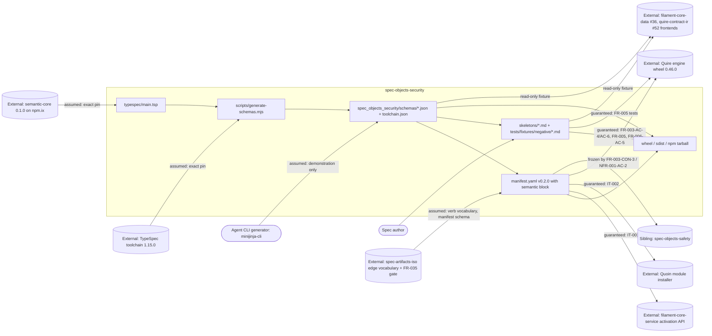

# SR-008: Scope and boundary review of the #13 semantic module contract spec

## Summary

This analysis drew the boundary of `spec-objects-security` as specified on
`13-semantic-module-contract`, allocated FR-002..FR-006, NFR-001 and IT-002 to
an owning component and responsibility class, and checked every responsibility
the spec claims, disclaims, or leans on against the neighbour that would own
it: quoin FR-070..FR-075, quire-rs FR-069..FR-072, filament-core-data
FR-031..FR-034, filament-core-service FR-035, and the sibling module
`agent-ix/spec-objects-safety`. It grounds on the reference review
`agent-ix/spec-objects-business` SR-007 and checks whether the dispositions
recorded there survived the port to this repository.

The boundary is drawn correctly in the large. The module owns its TypeSpec
source, its emitted schemas, its manifest `semantic` block, its skeleton and
negative fixtures, and the three security rules of FR-006; it re-specifies
neither extraction, nor install-time rejection, nor lowering, nor any runtime
security mechanism. Every named upstream blocker exists and is open, and every
issue number in the Out of Scope list resolves to a real ticket whose title
matches the claim, with one exception (FND-210).

Fourteen findings: seven medium, seven low, no high. The mediums are one
disclaimed responsibility whose named owner does not cover it (FND-200), the
`spec-objects-safety` coupling — stated against the wrong fields (FND-201),
with the coupling that does exist left unnamed (FND-202) and a graded-vocabulary
collision with that sibling unreconciled (FND-203) — one acceptance criterion
that asserts neighbour behaviour two open engine defects say does not occur
(FND-204), one neighbour schema revision left unpinned after the reference
review pinned it (FND-207), and one compatibility population that excludes the
artifacts the change can actually break (FND-213).

## Verdict

**Conditional pass.** No requirement in FR-002..FR-006, NFR-001 or IT-002
duplicates a quoin, quire-rs, filament-core-data or filament-core-service
responsibility outright, and the In Scope / Out of Scope split in `spec/spec.md`
is sound. Before tasking, the seven medium findings need a disposition:
FND-200 needs a ticket that actually covers this module's keys; FND-201 needs
the `spec-objects-safety` justification restated against what that repository
reads; FND-202 needs the forward coupling named; FND-203 needs the graded
vocabularies reconciled or the divergence recorded as intended; FND-204 needs
FR-003-AC-6 split into the half that holds and the half carried as an expected
failure; FND-207 needs the FR-035 revision pinned as SR-007 FND-210 pinned it
in the reference repository; FND-213 needs the out-of-repo population either
measured or explicitly allocated to `agent-ix/quoin#291`. None of these moves
the module's boundary; they close gaps at its edges.

## System Context

## In-Scope Responsibilities

What the module guarantees (spec.md In Scope; FR-002..FR-006; NFR-001):

- Author one TypeSpec model per security object type importing
  `@agent-ix/semantic-core` 0.1.0 and emit one JSON Schema 2020-12 file per
  model with the official emitter at a pinned toolchain, with `$id`/`$ref`,
  determinism, version-atomicity and drift-check rules (FR-002).
- Carry the quoin FR-070 `semantic` block and reference-form `data_schema`
  (path + SHA-256) for all twenty-three exported object types at manifest
  version 0.2.0, keeping every 0.1.0 locator unchanged (FR-003).
- Define the role-distinct declaration-record shape per object type — required,
  optional and forbidden keys, item rules, and the twelve marker plus two
  record support models (FR-004).
- Ship every skeleton as an executable positive fixture in the quoin
  FR-071/FR-072 Markdown forms, plus negative fixtures pinning what the schemas
  and the engine refuse, provisioned by `make dev-quire` and failing rather
  than skipping when the engine is absent (FR-005).
- Encode three security rules into the shipped schemas: no embedded material,
  ten closed graded vocabularies each with a least-granting unassessed member,
  and no JSON Schema `default` anywhere (FR-006).
- Keep the change additive: every 0.1.0 locator unchanged, the `traceability`
  block and every `allowed_links`/`roles` map unchanged, the checked-in 0.1.0
  skeleton set validating with zero errors (NFR-001).
- Package the schemas beside the manifest in the wheel, sdist and npm tarball
  (FR-002).

What the module explicitly disclaims (spec.md Out of Scope):

- filament-core-service implementation and deployment topology.
- Generated-language fixtures for the security types.
- Changing the `traceability` block or any `allowed_links` verb or target list.
- Extraction of the declared-but-unextracted record keys.
- Widening the typed-table constraint reader (`pattern`, `format`,
  multi-valued `enumValues`).
- Naming what a module load refused; record validation of a legacy-form
  artifact declaring `object:`.
- Publishing the Quire 0.46.0 wheel to a committable index.
- Resolving a reference-form `data_schema` into a stored snapshot at activation.
- Editing any corpus repository or vendored fixture.
- Runtime security enforcement — nothing here authenticates, authorizes or
  encrypts.

Every named upstream blocker was checked against GitHub and every one exists,
is open, and carries a title matching the use the spec makes of it:
`quire-rs#392` (release the 0.46.0 wheel to internal-pypi), `#221` (unknown
manifest key degrades to an empty model silently), `#394` (a `semantic.*` load
failure empties the registry with no diagnostic), `#391` (`validate_document`
validates the record as `{}` when a kind is unavailable);
`filament-core-service#23` (produce the semantic context and resolved
`data_schema` in registry snapshots); `quoin#290` (publish/promotion gate),
`#291` (corpus measurement gate, advisory), `#335` (semantic mapping for
unmapped sections and keys); `filament-core-data#11` (semantic-core language
packages), `#21`/`#22`/`#23` (the Rust, TypeScript and Python codegen
backends). The Out of Scope list therefore covers every blocker named in the
review brief; the only defect is how `#21`/`#22`/`#23` are characterised
(FND-210) and what `quoin#335` actually covers (FND-200).

## External Dependencies

| Dependency | Type | Assumed or Guaranteed | Contract |
|------------|------|------------------------|----------|
| Quoin module installer (FR-070, FR-073, FR-075) | Local CLI over filesystem | Guaranteed | IT-002; FR-003-AC-5 |
| Quire engine: loader FR-069, typed-table extraction FR-070, clause/operation extraction FR-071, record surface FR-072 | Python wheel 0.46.0 (`Registry`, `validate_document`, `extract_semantic`) | Guaranteed | FR-003-AC-4/AC-6, FR-005-AC-1..AC-5, FR-006-AC-5, NFR-001 metrics; no IT artifact by design (spec.md Requirements Architecture) |
| `semantic.record-invalid` diagnostic | Diagnostic code | Assumed | Exists in quire-rs source, in no quire-rs AC; FR-005 Dependencies name `quire-rs#391` as where it is settled |
| `semantic.unknown-constraint-keyword`, `semantic.properties-both-forms`, `semantic.dangling-clause-ref`, `semantic.invalid-type-token` | Diagnostic codes | Guaranteed | quire-rs FR-070-AC-3/AC-4/AC-6 and FR-071-AC-4 |
| filament-core-service module-manifest schema (FR-035) | JSON Schema, vendored by spec-artifacts-iso, Quoin and Quire | Assumed | FR-003 Inputs; **no revision pinned** (FND-207) |
| filament-core-service activation API | HTTP | Guaranteed | IT-001 (outside this review's scope) |
| `@agent-ix/semantic-core` 0.1.0 (filament-core-data FR-031..FR-033) | npm package on npm.ix; bundle at `https://schemas.agent-ix.org/semantic-core/0.1.0/` | Assumed | Exact pin in `package.json`; `$ref` host/version check FR-002-AC-3 |
| `@typespec/compiler` / `@typespec/json-schema` 1.15.0 | npm devDependencies | Assumed | Exact pin, `package-lock.json`, recorded in `toolchain.json` (FR-002-AC-1) |
| `spec-artifacts-iso` edge verb vocabulary (FR-004, 76 verbs incl. `mitigates`, `arises_from`) | Vendored vocabulary | Assumed | Not restated here; the freeze of FR-003-CON-3 preserves this module's use of it |
| `agent-ix/spec-objects-safety` | Sibling Filament module in the same bundle | Assumed | FR-003-CON-3, NFR-001-AC-2 freeze this module's `traceability`/`allowed_links`; see FND-201, FND-202, FND-203 |
| quoin mapping for the declared-but-unextracted keys | Published mapping | Assumed | Allocated to `quoin#335`, which does not cover this module's keys (FND-200) |
| Corpus repositories | Downstream, never edited | Assumed | FR-005-CON-1 (Inspection); NFR-001 Scope; `quoin#291` sweep |
| filament-core-data #36 / quire-contract-ir #52 frontends | Downstream read-only consumers | Assumed | No contract; consumers pin their own fixtures (FR-004, FR-005 Dependencies) |

## Responsibility Allocation

Components: **Module build** (`typespec/`, `scripts/generate-schemas.mjs`,
`make schemas`/`schemas-check`), **Module manifest**
(`spec_objects_security/manifest.yaml`), **Fixture set** (`skeletons/`,
`tests/fixtures/negative/`), **Packaging** (wheel, sdist, npm staging),
**Integration harness** (IT tests and the neighbour CLIs they drive).

| Requirement | Owning Component | Class |
|-------------|------------------|-------|
| FR-002 (emit JSON Schemas from TypeSpec, `$id`/`$ref`/determinism/version atomicity) | Module build | core |
| FR-002 wheel, sdist and npm outputs; `.gitattributes`; FR-002-CON-2/CON-4 | Packaging | infrastructure |
| FR-002-AC-4/AC-8/AC-9 drift check wired into `make lint` | Module build | cross-cutting |
| FR-003 (`semantic` block, reference-form `data_schema`, locator stability) | Module manifest | core |
| FR-003-CON-3, FR-003-AC-7 (freeze `traceability`/`allowed_links`) | Module manifest | cross-cutting |
| FR-003-AC-5 (install through Quoin) | Integration harness | cross-cutting |
| FR-004 (role-distinct declaration schemas, marker and support models) | Module build | core |
| FR-005 (executable skeletons, alternate sysml forms, negative fixtures) | Fixture set | core |
| FR-005 `make dev-quire` provisioning and fail-not-skip rule | Fixture set | cross-cutting |
| FR-005-CON-1 (no corpus repository or vendored fixture edited) | Fixture set | cross-cutting |
| FR-005-CON-3, FR-005-AC-9 (no credential-shaped literal) | Fixture set | cross-cutting |
| FR-006 (closed graded vocabularies, `material_ref` form) | Module build | core |
| FR-006 no-`default` rule, CON-1/CON-2 (fail-closed policy in schema, not lint) | Module build | cross-cutting |
| NFR-001 (additive compatibility, locator and edge-vocabulary stability) | Module manifest | cross-cutting |
| IT-002 (Quoin install with the semantic contract) | Integration harness | infrastructure |

Responsibilities the spec names that belong to a neighbour, and where the
neighbour claims them:

| Responsibility | Owner | Where the neighbour claims it |
|----------------|-------|-------------------------------|
| Reject unknown `semantic` key, unknown export, bad `package`, digest mismatch, unshipped `$ref`, path escape at install | Quoin | quoin FR-070, FR-073 |
| Derive `semantic/package-manifest.json` and per-export digests | Quoin | quoin FR-075 |
| Legacy-form detection and posture | Quoin (policy) / Quire (detection) | quoin FR-074 |
| Fail an object type with a `semantic.*` reason at load; record the digest | Quire | quire-rs FR-069 |
| `## Properties` to `FieldDecl[]`; constraint keyword set; type-token resolution | Quire (mapping published by Quoin) | quoin FR-071; quire-rs FR-070 |
| `## Invariants`/`## Operations` to `ClauseRef[]`/`OperationDecl[]` | Quire (mapping published by Quoin) | quoin FR-072; quire-rs FR-071 |
| `availability` states and the `semantic` record surface | Quire | quire-rs FR-072 |
| semantic-core grammar, scalars, JSON Schema projection, IR lowering | filament-core-data | FR-031..FR-034 |
| `semantic` block shape in the module-manifest schema | filament-core-service | FR-035 (revision unpinned here — FND-207) |
| Resolving a reference-form `data_schema` into a stored snapshot | filament-core-service | `#23` |
| Generated-language fixtures for the security types | filament-core-data | `#11` (kernel packages), `#19` (frontend/compiler core), `#21`/`#22`/`#23` (backends); publication gated by `quoin#290` — spec.md misattributes the frontend (FND-210) |
| Publishing the Quire wheel to a committable index | quire-rs | `#392` |
| Naming the refused key / path at load | quire-rs | `#221`, `#394` |
| Record validation of a legacy-form artifact declaring `object:` | quire-rs | `#391` |
| Corpus sweep and promotion gate | Quoin | `#291`, `#290` |
| Edge verb vocabulary (`mitigates`, `arises_from`, …) | spec-artifacts-iso | FR-004 |
| Hazard and failure-mode coverage checks | spec-objects-safety | its own `manifest.yaml` `traceability` block, commit `5e1e016` |
| Mapping for `severity`, `likelihood`, `impact`, `status`, `level`, `trust_level`, `stride_category`, `effectiveness`, `lifecycle`, `material_ref` and the cross-reference lists | Claimed for `quoin#335`; **that ticket covers spec-objects-business's key set only** | FND-200 |

## The spec-objects-safety coupling, verified

The review brief asked this claim to be verified rather than accepted. It was
checked against `/home/peter/dev/spec-objects-safety` at commit `5e1e016`
("feat: declare bidirectional hazard coverage (spec-objects-security#5) (#1)")
and against `agent-ix/spec-objects-safety#2`. The findings of fact:

1. **The hazard-coverage declaration lives in the safety module's own
   manifest, not in this one.** `spec_objects_safety/manifest.yaml` declares
   `traceability.required_relations` with `hazard-has-mitigation`
   (`from: hazard`, `edges: [mitigates]`, `to: []`, `direction: incoming`,
   `check: unmitigated-hazard`) and `failure-mode-has-mitigation`
   (`from: failure_mode`, same shape, `check: unmitigated-failure-mode`), plus
   `acyclic_edges: [arises_from]`. Both `from` archetypes (`hazard`,
   `failure_mode`) are safety's own object types.

2. **No field of this module's manifest is read by that repository.** A sweep
   of `spec_objects_safety/` and `tests/` finds `spec-objects-security` only in
   YAML comments and test docstrings citing issue numbers (`#5`, `#6`, `#7`,
   `#8`) and one nav-order comment. `tests/test_manifest.py` asserts nothing
   about this module. The commit message names `#5` because the issue that
   asked for the coverage declaration was filed in this repository, not because
   the declaration reads anything here.

3. **The fields the two modules genuinely share are the verb name and the
   target lists, and the verb belongs to a third repository.** `mitigates` and
   `arises_from` are members of the `spec-artifacts-iso` FR-004 vocabulary
   (76 verbs), which safety's own manifest comment cites as the reason it added
   no new verb. Both modules independently declare `edges: [mitigates]` with
   `to: []` and `direction: incoming`; `to: []` means the relation places no
   constraint on the mitigation's source archetype, so safety's checks are
   satisfied by whatever authors an incoming `mitigates` edge — in practice the
   requirement artifacts of the `iso` module.

4. **This module's only structural influence on safety's checks is
   `control.allowed_links.mitigates`, and today it excludes safety's
   archetypes.** `manifest.yaml` line 472 declares
   `mitigates: [threat, risk, vulnerability]` for the `control` object type. A
   security `control` therefore cannot legally name a `hazard` or a
   `failure_mode` as a mitigation target, so a control can never satisfy
   safety's `unmitigated-hazard` check. Freezing the target list preserves that
   exclusion; it does not "keep safety's hazard-coverage edges unaffected",
   because those edges are safety's own.

**Which fields are actually depended on:** none of this module's manifest is
read by `spec-objects-safety` today. The dependency the freeze protects is one
of *symmetry and future compatibility* — safety copied this module's
`traceability` shape, and this module's `control.allowed_links.mitigates`
target list is the single field that would change what a security control may
mitigate across the two modules.

**Is the freeze stated correctly?** No — the *justification* is wrong even
though the *obligation* is right (FND-201). FR-003-CON-3, FR-003 Behavior,
NFR-001 Statement, NFR-001 Rationale and spec.md Out of Scope all say safety
"declares its bidirectional hazard coverage against this module's edge
vocabulary and coverage checks". It declares it against its own. The correct
statement is narrower and still worth freezing: the two modules share the
`spec-artifacts-iso` verb `mitigates` under mirrored `traceability` shapes, and
`control.allowed_links.mitigates` is the only field of this manifest that can
change what crosses the boundary.

**Is it stated sufficiently?** For the fields it names, yes — FR-003-AC-7 and
NFR-001-AC-2 both test equality against a checked-in 0.1.0 baseline, spec.md
Out of Scope makes a change there a reported cross-repository contract change
rather than an edit, and NFR-001 carries the metric at threshold 0. Three gaps
remain: FR-003-AC-7 omits `roles` although FR-003 Behavior, FR-003-CON-3's
sibling clause and NFR-001-AC-2 all include it (FND-205); FR-003-CON-3's
"byte-identical" is not literally testable against a file whose other bytes
change in the same commit (FND-206); and the coupling that `spec-objects-safety#2`
will actually create — "Define imports to architecture, operational,
**security**, and assurance types without duplicating them" — is nowhere named
in this spec, even though FR-003 fixes `imports: {}` and `semantic.exports`,
and FR-002-CON-5 puts the manifest `version` inside every schema `$id` that a
future safety import would `$ref` (FND-202).

## Findings

| ID | Severity | Summary | Refs |
|----|----------|---------|------|
| FND-200 | medium | spec.md places the declared-but-unextracted keys (`severity`, `likelihood`, `impact`, `status`, `level`, `trust_level`, `stride_category`, `effectiveness`, `lifecycle`, `material_ref` and the cross-reference lists) out of scope with the mapping "owned by `agent-ix/quoin#335`". That ticket's body scopes itself to the enumeration `## Values` form and to a named table of ten keys (`values`, `relations`/`members`/`owner`, `states`, `transitions`, `steps`, `emits`, `persists`, `source`, `vocabulary`) that `spec-objects-business#4` declares; none of this module's keys appears in it, and quire-rs FR-070/FR-071 read only `## Properties`, `## Invariants` and `## Operations`. The responsibility is disclaimed here and claimed nowhere — the same escape SR-007 FND-200 closed for the business repository, recurring because the ticket it was closed onto is repo-scoped. Either add this module's key set to `quoin#335` (and say so) or file the sibling ticket and cite it. | spec.md Out of Scope; FR-004 Behavior (optional keys); FR-005 Behavior (graded value rows); quoin#335 body; quire-rs FR-070, FR-071 |
| FND-201 | medium | Five places state that `agent-ix/spec-objects-safety` "declares its bidirectional hazard coverage against this module's edge vocabulary and coverage checks". Verified false: safety's `hazard-has-mitigation` and `failure-mode-has-mitigation` relations are declared in `spec_objects_safety/manifest.yaml` over safety's own `hazard`/`failure_mode` archetypes with `to: []`, its tests assert nothing about this module, and the verb `mitigates` belongs to spec-artifacts-iso FR-004. The freeze obligation is right and should stay; its stated reason names a dependency that does not exist, which makes the constraint impossible to reason about when someone later asks whether a specific edit is safe. Restate it as: the two modules mirror one `traceability` shape over a shared iso verb, and `control.allowed_links.mitigates` (`[threat, risk, vulnerability]`) is the one field of this manifest that governs what a security control may mitigate. | spec.md Out of Scope; FR-003 Behavior; FR-003-CON-3; NFR-001 Statement, Rationale, Dependencies; spec-objects-safety `5e1e016`, `spec_objects_safety/manifest.yaml` traceability block |
| FND-202 | medium | The coupling with `spec-objects-safety` that will exist is unnamed. `agent-ix/spec-objects-safety#2` Deliverables include "Define imports to architecture, operational, security, and assurance types without duplicating them", which makes safety a consumer of this module's `semantic.exports` names, its `package` identity, and its schema `$id` URLs. FR-002-CON-5 embeds the manifest `version` in every `$id`, so each version bump rewrites every URL a safety import would `$ref`. Neither spec.md, FR-002 nor FR-003 names safety (or any module) as a downstream consumer of `exports`/`$id`, and FR-003 fixes `imports: {}` without saying that the reverse direction is expected. Name the consumer and state the bump obligation toward it, or record that cross-module import is deferred to `quoin#290`. | spec.md Out of Scope, References; FR-002 Behavior (`$id` base), FR-002-CON-5; FR-003 Behavior (`exports`, `imports: {}`); spec-objects-safety#2 Deliverables |
| FND-203 | medium | FR-006 mints closed vocabularies `Severity` (`none`, `low`, `medium`, `high`, `critical`, `unknown`) and `Likelihood` (`rare`, `unlikely`, `possible`, `likely`, `almost_certain`, `unknown`) for security types. The sibling module `spec-objects-safety` already constrains columns of the same two names on `hazard` with disjoint member sets — severity `negligible`/`marginal`/`critical`/`catastrophic`, likelihood `incredible`/`improbable`/`remote`/`occasional`/`probable`/`frequent` — as advisory `lint_rules`. In a bundle carrying both modules an author meets two closed sets under one word, differing by archetype, one advisory and one schema-enforced, with `critical` meaning a different grade in each. No requirement here, in safety, or in a shared owner reconciles them. Either record the divergence as deliberate and domain-scoped (with the reason each standard lineage keeps its own scale) or raise it to a shared owner before both are frozen. | FR-006 Behavior (vocabulary table), FR-006-AC-1; spec-objects-safety `manifest.yaml` `lint_rules` `hazard-severity`, `hazard-likelihood` |
| FND-204 | medium | FR-003-AC-6 requires that a `semantic` block gaining key `foo` "is refused by Quire's loader naming `foo`" and an altered digest "refused naming the path", verification `Test`, unqualified. FR-003 Behavior and spec.md both record that quire 0.46.0 does neither — `quire-rs#221` (unknown key empties the model silently) and `quire-rs#394` (digest mismatch drops the type with no diagnostic) — and that the naming half is carried as an explicit expected failure. The carve-out lives only in prose two documents away from the criterion it qualifies, so the AC as written is a red row with no route to an owner. Split it: AC-6a (the copy is refused) as a passing contract check on quire-rs FR-069, AC-6b (the diagnostic names the key or path) as an expected failure citing `#221`/`#394`. | FR-003-AC-6; FR-003 Behavior (measured against quire 0.46.0); spec.md Out of Scope; quire-rs#221, #394 |
| FND-207 | medium | FR-003 Inputs pin the module-manifest schema only as "the module-manifest schema with the `semantic` block, as vendored by `spec-artifacts-iso` … and by Quoin and Quire", with no revision, version or FR-035 criterion range, and spec.md `relationships` names `ix://agent-ix/filament-core-service/FR-035` bare. SR-007 FND-210 raised exactly this for the reference repository and its disposition pinned revision `a77f31e` in FR-001 Behavior, FR-003 Inputs and IT-001 Preconditions so all consumers judge one schema. That pin did not port. Three vendored copies (iso gate, Quoin, Quire) can therefore admit or refuse this manifest differently with no defect attributable to any of them. Pin the FR-035 revision — or the spec-artifacts-iso version that vendors it — in FR-003 Inputs and spec.md. | FR-003 Inputs; spec.md relationships; spec-objects-business SR-007 FND-210 and its disposition |
| FND-213 | medium | NFR-001 measures additive compatibility over one population: "the twenty-three skeletons as they stood at manifest version 0.1.0", all in this repository. Its Verification explains that population is safe because no 0.1.0 skeleton carries frontmatter `object:`. That reasoning does not extend to the artifacts the change can actually break: at 0.1.0 every object type carried `data_schema: {type: object}`, so any corpus artifact declaring `object: threat` validated its record trivially; at 0.2.0 it is validated against a sealed role schema and can newly fail `semantic.record-invalid` at error severity, which `legacy_forms: warning` does not soften (that key governs Properties forms, not record validity). NFR-001 Scope mentions corpus artifacts only as "operational context" and its metric table has no row for them. Either state that no corpus artifact declares `object:` for a security type (a measurement, made once) or allocate the population explicitly to the `quoin#291` advisory sweep in the Measurement table rather than in Dependencies prose. | NFR-001 Statement, Scope, Measurement and Evaluation, Verification; FR-003 Behavior (`legacy_forms: warning`); quoin#291 |
| FND-205 | low | FR-003 Behavior requires the manifest to keep "the `traceability` block and every object type's `allowed_links` and `roles` unchanged", FR-003-CON-3 names `traceability` and `allowed_links`, and NFR-001-AC-2 tests `traceability`, `allowed_links` and `roles`. FR-003-AC-7 tests only "the `traceability` block and every `allowed_links` map", omitting `roles`. Within FR-003 the obligation is therefore stated but not fully verified. Add `roles` to FR-003-AC-7 or drop it from FR-003 Behavior. | FR-003 Behavior; FR-003-CON-3; FR-003-AC-7; NFR-001-AC-2 |
| FND-206 | low | FR-003-CON-3 and NFR-001 Statement require the frozen blocks to be "byte-identical to 0.1.0". The manifest file's bytes necessarily change in the same commit (new `semantic` block, reference-form `data_schema`, added `required: false` locators), and NFR-001's metric row reads "`traceability` and `allowed_links` bytes changed: 0" without naming what is compared. FR-003-AC-7 and NFR-001-AC-2 both say "equal to the checked-in 0.1.0 baseline", which is a parsed comparison. State the comparison once — parsed blocks against a checked-in baseline extract — so the constraint and the criterion describe the same test. | FR-003-CON-3; NFR-001 Statement, Measurement row 2; FR-003-AC-7; NFR-001-AC-2 |
| FND-208 | low | FR-005 Behavior lists ten mandatory negative fixtures and labels "the last three" as re-checks of the engine's published diagnostics. Four are engine-owned, not three: the secret embedding material through a `default:` constraint cell expects `semantic.unknown-constraint-keyword`, which is quire-rs FR-070's closed-keyword refusal, and FR-006 Behavior itself says so ("the pinned Quire wheel's typed-table reader refuses a `default:` constraint cell"). As listed, an engine-owned refusal is counted among the schema-owned ones, so a red row routes to this module's schemas. Move it into the labelled group, and note that FR-006-AC-5 is the same contract check stated a second time. | FR-005 Behavior (negative fixtures), FR-005-AC-5; FR-006 Behavior, FR-006-AC-5; quire-rs FR-070 |
| FND-209 | low | IT-002 pins the Quoin dependency to a build from `agent-ix/quoin` main at or after commit `3e842ce` (reason stated: no release tag carries the semantic module), and IT-002-SC-04 verifies that the derived `semantic/package-manifest.json` names one export per `semantic.exports` entry — which is quoin FR-075's own acceptance criterion. SR-007 FND-208's disposition kept the equivalent step in the reference repository but labelled it a contract check on quoin FR-075 rather than a claim of ownership; that label did not port. Mark SC-04 as a contract check on quoin FR-075, and re-pin to a Quoin release once one carries the semantic module. | IT-002 Target Integration, Preconditions, SC-04; quoin FR-075; spec-objects-business SR-007 FND-208 disposition |
| FND-210 | low | spec.md Out of Scope attributes generated-language fixtures to "the TypeSpec frontend and compiler core (`agent-ix/filament-core-data#21`, `#22`, `#23`)". Those three are the per-language codegen backends — "Implement and harden the Rust/Serde semantic codegen backend", "…the TypeScript semantic codegen and validator backend", "Qualify and integrate datamodel-code-generator for Python/Pydantic and dataclass packages". The TypeSpec frontend and compiler core is `filament-core-data#19`. The allocation lands on real, open tickets, so the deliverable is owned; only the description of what they are is wrong, and it will mislead anyone tracing the gate. Name `#19` as the frontend and `#21`/`#22`/`#23` as the backends. | spec.md Out of Scope; filament-core-data#19, #21, #22, #23 |
| FND-211 | low | Issue #13's merge gate carries three items. "No schema default grants permission, trust, or control effectiveness" is fully owned (FR-006 Behavior, FR-006-AC-3/AC-4/AC-6, FR-006-CON-1/CON-2). "Advisory-only until promotion" is addressed by FND-212. The third — "Security review is required before release" — is allocated to no requirement, constraint, or acceptance criterion in the spec; it is discharged only by the sibling `security.md` review of this set, which no artifact in `spec/` names as the discharge. Record the gate item against an artifact (the review, or a release constraint) so it is visible from the spec. | spec/spec.md; issue #13 "Safety / merge gate"; spec/reviews/13-semantic-module-contract/security.md |
| FND-212 | low | "Advisory-only until promotion" is allocated in mechanism but not in statement. The mechanism is real and owned here: FR-003 Behavior fixes `compatibility_posture: additive` and `legacy_forms: warning` in the `semantic` block, FR-005-CON-1 forbids editing any corpus repository, and NFR-001 sets every error metric to threshold 0. But the gate itself appears only as one sentence of NFR-001 Rationale ("The ticket's merge gate is advisory-only until corpus promotion") and as a Dependencies line naming `quoin#291`; no requirement states that this module SHALL NOT assert enforcement, and no AC ties the posture keys to the gate. State the rule where FR-003 sets the keys, citing `quoin#290`/`#291` as the gate owners. By contrast "no corpus repository edited" is properly allocated — FR-005-CON-1 (Boundary, Inspection) and NFR-001 Scope. | NFR-001 Rationale, Scope, Dependencies; FR-003 Behavior (`legacy_forms`, `compatibility_posture`); FR-005-CON-1; quoin#290, #291 |

## Dispositions

| Finding | Disposition |
|---|---|
| FND-200 | Open — needs a ticket that names this module's key set, or an amendment to `quoin#335`; cite it in spec.md Out of Scope, FR-004 Behavior and FR-005 Behavior. |
| FND-201 | Open — restate the `spec-objects-safety` justification in spec.md Out of Scope, FR-003 Behavior, FR-003-CON-3 and NFR-001 against what that repository reads (the mirrored `traceability` shape, the iso `mitigates` verb, and `control.allowed_links.mitigates`). Keep the freeze. |
| FND-202 | Open — name the forward coupling (`spec-objects-safety#2` imports of this module's exports and version-bearing `$id`s) in spec.md and FR-002-CON-5, or defer it explicitly to `quoin#290`. |
| FND-203 | Open — reconcile `Severity`/`Likelihood` with the safety module's columns of the same names, or record the divergence as deliberate in FR-006 Behavior with its lineage reason. |
| FND-204 | Open — split FR-003-AC-6 into the contract check that passes and the expected failure citing `quire-rs#221`/`#394`. |
| FND-205 | Open — add `roles` to FR-003-AC-7, or remove it from FR-003 Behavior. |
| FND-206 | Open — state the comparison as parsed blocks against a checked-in baseline in FR-003-CON-3 and NFR-001. |
| FND-207 | Open — pin the FR-035 revision (or the vendoring `spec-artifacts-iso` version) in FR-003 Inputs and spec.md `relationships`, as SR-007 FND-210 was dispositioned upstream. |
| FND-208 | Open — move the `default:` constraint-cell negative into FR-005's labelled engine-owned group and cross-reference FR-006-AC-5. |
| FND-209 | Open — label IT-002-SC-04 a contract check on quoin FR-075; re-pin to a Quoin release when one carries the semantic module. |
| FND-210 | Open — name `filament-core-data#19` as the frontend and compiler core; keep `#21`/`#22`/`#23` as the backends. |
| FND-211 | Open — record the "security review before release" gate item against a named artifact. |
| FND-212 | Open — state the advisory-only rule where FR-003 sets `legacy_forms`/`compatibility_posture`, citing `quoin#290`/`#291`. |
| FND-213 | Open — measure the out-of-repo `object:`-declaring population once, or allocate it to `quoin#291` in NFR-001's Measurement table. |

### Round record (2026-09-04)

Applied in the review-fix round: FND-200 (the `quoin#335` scope gap recorded in spec.md and FR-004 rather than assumed away), FND-201 (the `spec-objects-safety` justification corrected in all five places: safety reads no field of this manifest, and the real coupling is the mirrored `traceability` shape and `control.allowed_links.mitigates`), FND-202 and FND-203 (the forward import coupling and the `Severity`/`Likelihood` name collision added to Out of Scope), FND-205 (`roles` and `lexicon` added to FR-003-AC-7 and NFR-001-AC-2), FND-206 ("byte-identical" replaced by parsed equality, which is what the tests assert and what a consumer reads), FND-210 (the generated-language backends renamed to `#21`/`#22`/`#23` over the `#19` frontend), FND-211 (FR-006-AC-8 makes the security-review gate an artifact), FND-213 (NFR-001 Scope names the out-of-repo population it deliberately does not measure).

Recorded without change, and carried into the report rather than silently closed: FND-204, FND-207..FND-209, FND-212.
