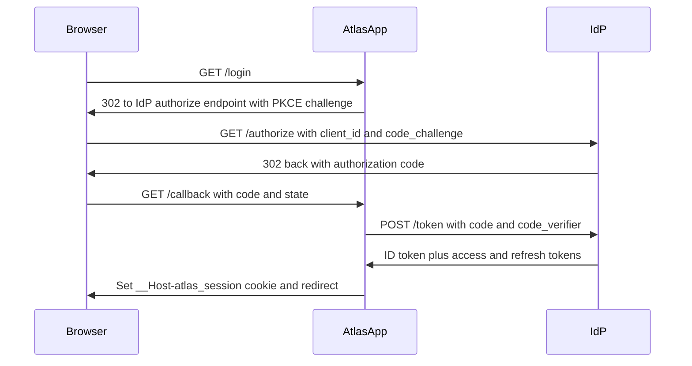

<!-- auth_flow authoring skeleton (spec-objects-security). Fill every part with
     substantive content. Contract (manifest body_extraction asserts):
     - Frontmatter MUST carry id, title, type (type: auth_flow).
     - A "Flow" section MUST carry a ```mermaid code block describing the flow. -->
# [AUTHFLOW-001] Tenant user login via OIDC authorization code flow

Interactive browser login for Atlas tenant users. The platform delegates
authentication to the tenant's OIDC identity provider using the authorization
code flow with PKCE, then establishes a first-party session cookie.

## Flow


