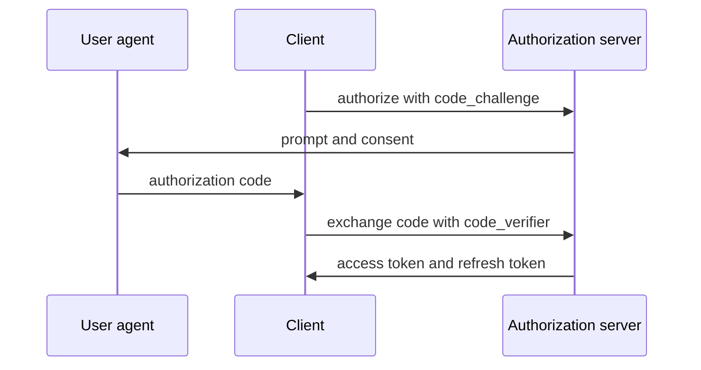

<!-- auth_flow authoring skeleton (spec-objects-security). Fill every section with
     substantive content. Contract (manifest body_extraction asserts):
     - Frontmatter MUST carry id, title, type: auth_flow, object: auth_flow.
     - "## Flow" (H2, required) holds a fenced `mermaid` diagram.
     - "## Operations" (H2): one `### <name>` per exchange, an optional param
       table, a `Returns: <Type>[<multiplicity>]` line and optional Pre:/Post:
       lines. AuthFlow.json requires at least one operation — a flow is its
       exchanges. -->
# [AUTH-001] AuthorizationCodeWithPkce

## Flow

```mermaid
sequenceDiagram
  participant U as User agent
  participant C as Client
  participant A as Authorization server
  C->>A: authorize with code_challenge
  A->>U: prompt and consent
  U->>C: authorization code
  C->>A: exchange code with code_verifier
  A->>C: access token and refresh token
```

## Operations

The exchanges this flow performs. Each operation owns one `### <name>`
heading; the param table is the typed declaration of its inputs.

### authorize

Start the flow and obtain an authorization code.

| Param | Type | Multiplicity | Constraints |
|---|---|---|---|
| code_challenge | String | 1..1 | minLength: 43 |
| redirect_uri | String | 1..1 | minLength: 1 |

Returns: String[1..1]

### exchange_code

Exchange the code and verifier for a token pair.

| Param | Type | Multiplicity | Constraints |
|---|---|---|---|
| code | String | 1..1 | minLength: 1 |
| code_verifier | String | 1..1 | minLength: 43 |

Returns: Boolean[1..1]

### refresh

Rotate the grant family and issue a fresh token pair.

| Param | Type | Multiplicity | Constraints |
|---|---|---|---|
| presented_token_locator | String | 1..1 | minLength: 1 |

Returns: Boolean[1..1]
