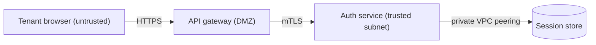

<!-- trust_boundary authoring skeleton (spec-objects-security). Fill every part
     with substantive content. Contract (manifest body_extraction asserts):
     - Frontmatter MUST carry id, title, type (type:
       trust_boundary).
     - A "Boundary" section MUST carry a ```mermaid code block drawing the
       boundary between zones. -->
# [BOUND-001] Edge to auth-service trust boundary

Separates the untrusted internet, the DMZ-hosted API gateway, and the trusted
private subnet where the Atlas auth service and session store run. Everything
crossing inward is re-authenticated: the gateway terminates TLS and the auth
service only accepts mTLS connections from the gateway.

## Boundary


