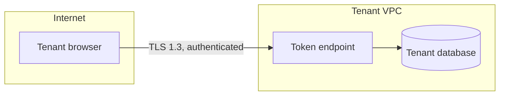

<!-- trust_boundary authoring skeleton (spec-objects-security). Fill every section with
     substantive content. Contract (manifest body_extraction asserts):
     - Frontmatter MUST carry id, title, type: trust_boundary,
       object: trust_boundary.
     - "## Boundary" (H2, required) holds a fenced `mermaid` diagram.
     - "## Properties" (H2): requires an identity row and a `trust_level` row.
     - "## Invariants" (H2): TrustBoundary.json requires at least one clause —
       a boundary that admits every crossing is not a boundary. -->
# [BOUND-001] TenantNetworkEdge

## Boundary


```mermaid
flowchart LR
  subgraph untrusted[Internet]
    client[Tenant browser]
  end
  subgraph trusted[Tenant VPC]
    api[Token endpoint]
    db[(Tenant database)]
  end
  client -->|TLS 1.3, authenticated| api
  api --> db
```

## Properties

| Field | Type | Multiplicity | Constraints |
|---|---|---|---|
| boundary_id | UUID | 1..1 | identity |
| trust_level | String | 1..1 | minLength: 1 |
| ingress_protocol | String | 1..1 | minLength: 1 |
| mutual_tls_required | Boolean | 1..1 |  |

## Invariants

The clauses this boundary enforces on every crossing. Each clause owns one
`ocl` fence under its own `### <clauseId>` heading; the fence text is carried
verbatim and never evaluated here.

### EveryCrossingIsAuthenticated

```ocl
context TenantNetworkEdge
inv EveryCrossingIsAuthenticated:
  self.ingress_protocol <> 'plaintext'
```

### UntrustedSideNeverReachesTheDatabase

```ocl
context TenantNetworkEdge
inv UntrustedSideNeverReachesTheDatabase:
  self.trust_level = 'untrusted' implies self.mutual_tls_required
```
