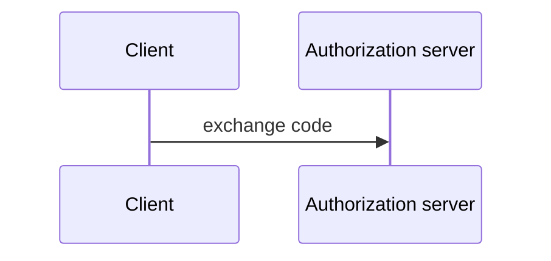

# [negative-009] AuthFlowWithDanglingPost

## Flow

## Operations

The exchanges this flow performs.

### exchange_code

Exchange the code for a token pair.

| Param | Type | Multiplicity | Constraints |
|---|---|---|---|
| code | String | 1..1 | minLength: 1 |

Post: NoSuchClause
